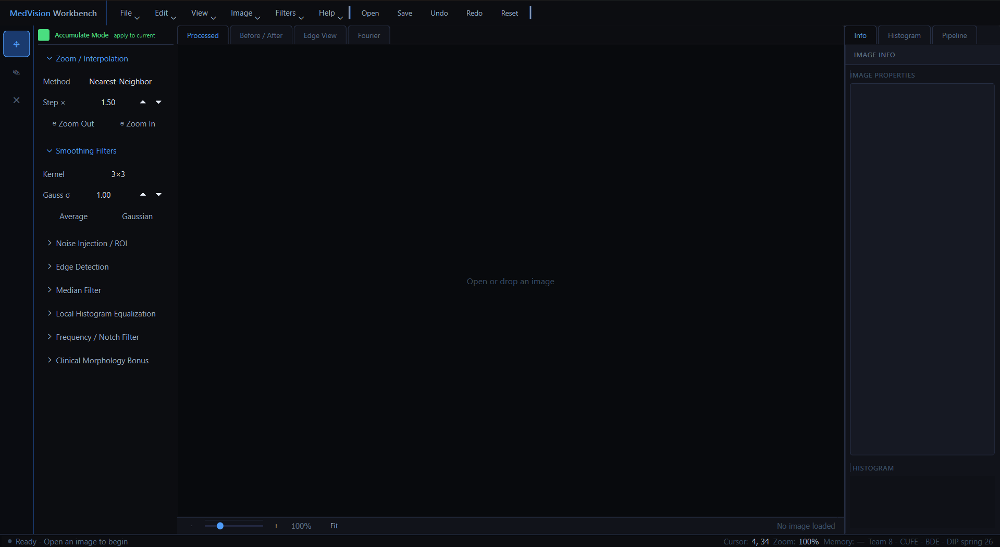

# Medical Image Enhancement Desktop App

A desktop application for **medical and standard image enhancement**, built with **Python, PyQt5, NumPy, Pillow, and pydicom**.

This project applies core **digital image processing** concepts to a functional desktop GUI, with support for medical image formats such as **DICOM** alongside common image formats including JPEG, PNG, BMP, and TIFF.

---

## Overview

The application is designed to help users load, inspect, enhance, and export medical or standard images through a clean desktop interface.

It focuses on spatial-domain image enhancement and restoration techniques, with core algorithms implemented from scratch, including interpolation, smoothing, median filtering, edge detection, and local histogram equalization.

The project was developed as part of a **Medical Image Processing and Computer Vision course** at Cairo University, Biomedical Engineering.

---

## Key Features

* Desktop GUI built using **PyQt5**
* Support for medical and standard image formats:

  * DICOM `.dcm`, `.dicom`
  * JPEG `.jpg`, `.jpeg`
  * PNG `.png`
  * BMP `.bmp`
  * TIFF `.tif`, `.tiff`
* From-scratch image processing algorithms:

  * Nearest-neighbor zoom
  * Bilinear zoom
  * Average smoothing filter
  * Gaussian smoothing filter
  * Median filtering
  * Sobel edge detection
  * Prewitt edge detection
  * Block-wise local histogram equalization
* Sequential enhancement workflow
* Undo and reset functionality
* Metadata panel for image information
* Histogram visualization
* Background worker thread for long processing operations
* Export support for processed images

---

## My Role

I contributed to the development of the core image-processing modules and application structure.

My work included:

* Implementing image enhancement and restoration algorithms
* Working with medical and standard image formats
* Supporting the GUI workflow and processing pipeline
* Contributing to code organization for team integration
* Applying spatial-domain and frequency-domain image processing concepts in a working software system

---

## Tech Stack

| Category               | Tools                                     |
| ---------------------- | ----------------------------------------- |
| Programming Language   | Python                                    |
| GUI Framework          | PyQt5                                     |
| Image Processing       | NumPy, Pillow                             |
| Medical Image Handling | pydicom                                   |
| Development Tools      | Git, VS Code                              |
| Course Area            | Medical Image Processing, Computer Vision |

---

## Project Structure

```text
medical-image-enhancement-app/
  main.py
  requirements.txt
  app/
    core/
      __init__.py
      image_processor.py
      styles.py
    DIP/
      __init__.py
      edge_detection.py
      histogram_equalization.py
      median.py
      smoothing.py
      zoom.py
    gui/
      __init__.py
      main_window.py
      panels.py
      sidebar.py
      widgets.py
    io/
      __init__.py
      image_io.py
    workers/
      __init__.py
      processing_worker.py
```

---

## Algorithms Implemented

### Interpolation

* Nearest-neighbor interpolation
* Bilinear interpolation

### Smoothing Filters

* Average filter
* Gaussian smoothing filter

### Nonlinear Filtering

* Median filtering

### Edge Detection

* Sobel operator
* Prewitt operator
* Gradient magnitude visualization

### Histogram Processing

* Block-wise local histogram equalization

---

## Supported Inputs and Outputs

### Input Formats

* DICOM `.dcm`, `.dicom`
* JPEG `.jpg`, `.jpeg`
* PNG `.png`
* BMP `.bmp`
* TIFF `.tif`, `.tiff`

### Output Formats

* PNG
* JPEG
* BMP

---

## Installation

### 1. Clone the repository

```bash
git clone https://github.com/AliIbrahim174/medical-image-enhancement-app.git
cd medical-image-enhancement-app
```

### 2. Create a virtual environment

#### Windows PowerShell

```powershell
python -m venv .venv
.\.venv\Scripts\Activate.ps1
```

#### macOS / Linux

```bash
python3 -m venv .venv
source .venv/bin/activate
```

### 3. Install dependencies

```bash
pip install -r requirements.txt
```

---

## Run the Application

```bash
python main.py
```

---

## How to Use

1. Open an image using **File > Open Image**.
2. Choose an operation from the sidebar:

   * Zoom
   * Smoothing
   * Median filtering
   * Edge detection
   * Local histogram equalization
3. Inspect the results in the output tabs:

   * Processed image
   * Before / after view
   * Edge view
   * Histogram view
4. Track applied operations in the processing pipeline.
5. Undo the latest operation or reset to the original image.
6. Save the processed image using **File > Save Processed Image**.

---

## Processing Notes

* Zooming is applied from a clean zoom base to reduce cumulative interpolation artifacts.
* Large linear filters are routed through FFT-based convolution to improve responsiveness.
* Edge operators output normalized horizontal gradient, vertical gradient, and gradient magnitude.
* Local histogram equalization is block-wise and non-overlapping.
* Long operations are handled through a background worker thread to keep the GUI responsive.

---

## Screenshots

Add screenshots here after uploading them to the repository.

Recommended screenshots:

```text
assets/screenshots/main-window.png
assets/screenshots/dicom-view.png
assets/screenshots/filter-result.png
assets/screenshots/edge-detection.png
assets/screenshots/histogram-view.png
```

Example Markdown after adding screenshots:

```md


```

---

## Course Context

This project was developed for a **Medical Image Processing and Computer Vision** course at **Cairo University — Biomedical Engineering**.

The goal was to convert theoretical image-processing concepts into a working desktop application with a real graphical interface, medical image support, and modular processing logic.

---

## Future Improvements

* Add more frequency-domain filters
* Add image restoration methods
* Improve DICOM metadata visualization
* Add batch processing support
* Add automated unit tests for processing modules
* Package the application as an executable desktop app

---

## License

This repository is currently shared for academic and portfolio purposes.

If this project is extended for public reuse, a formal open-source license such as MIT or BSD-3-Clause should be added.
